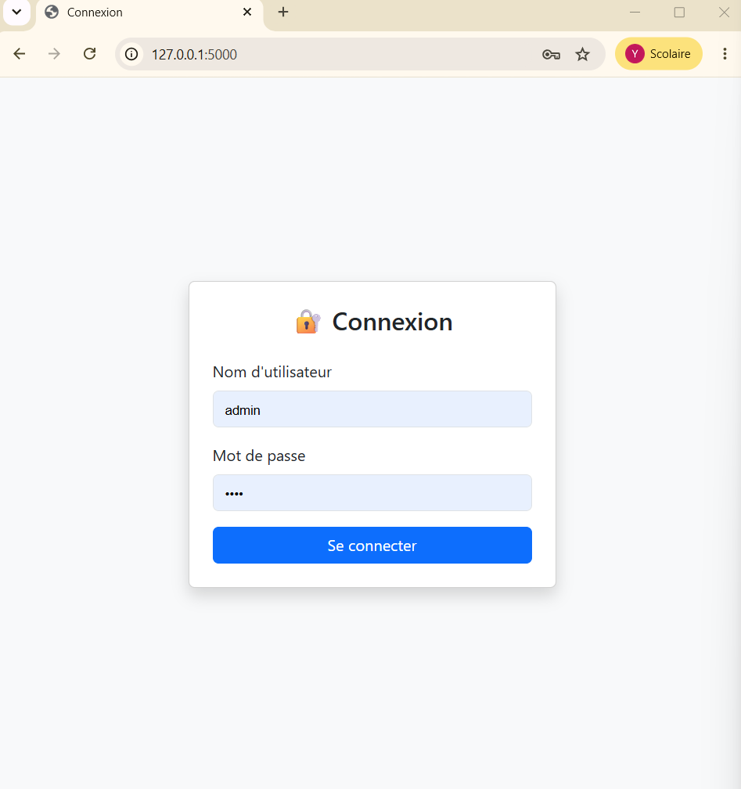
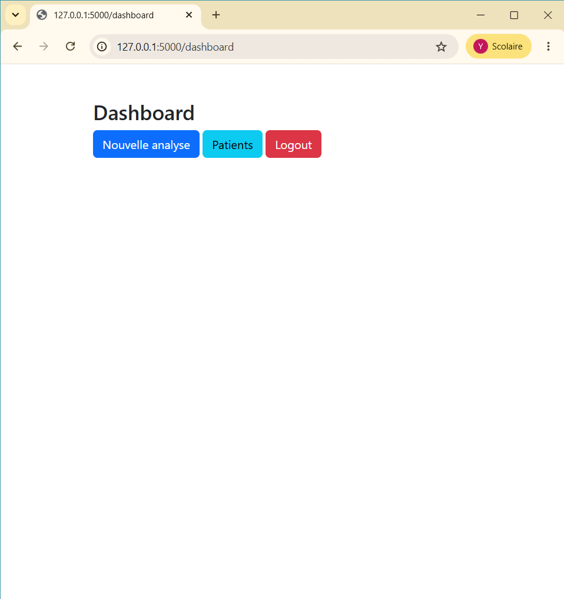
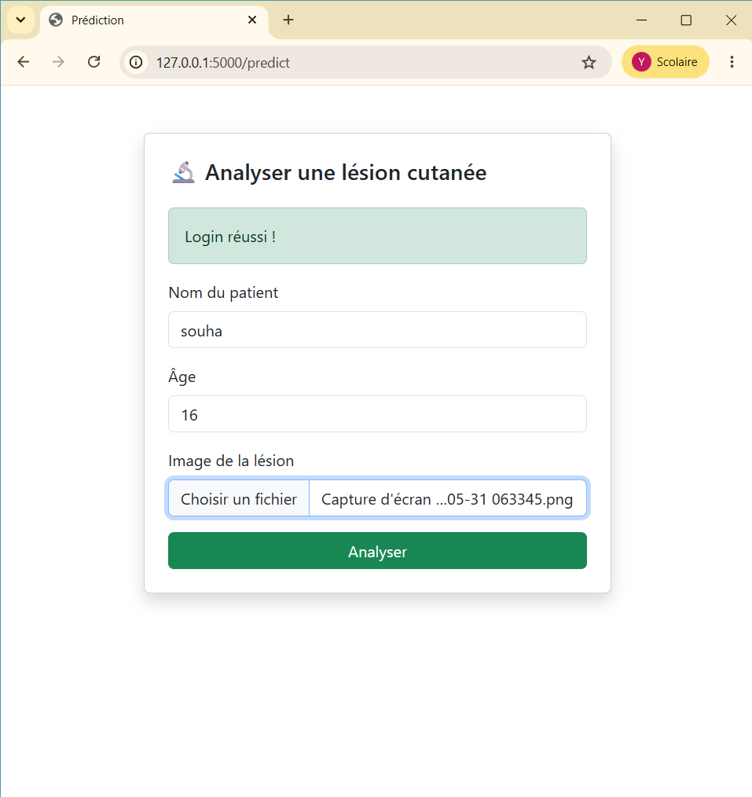
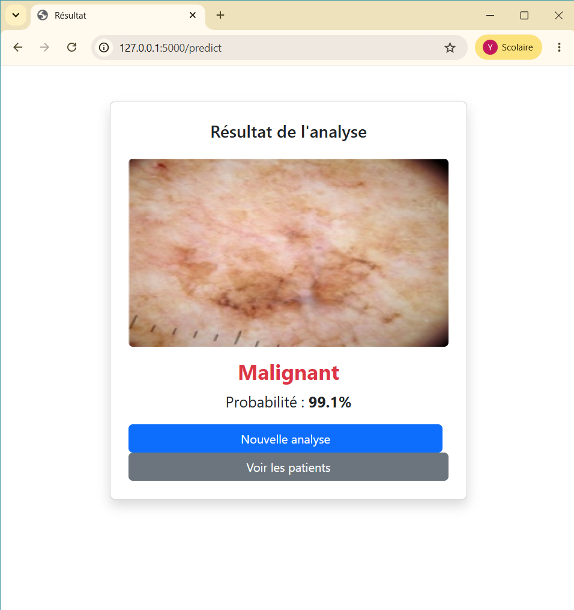
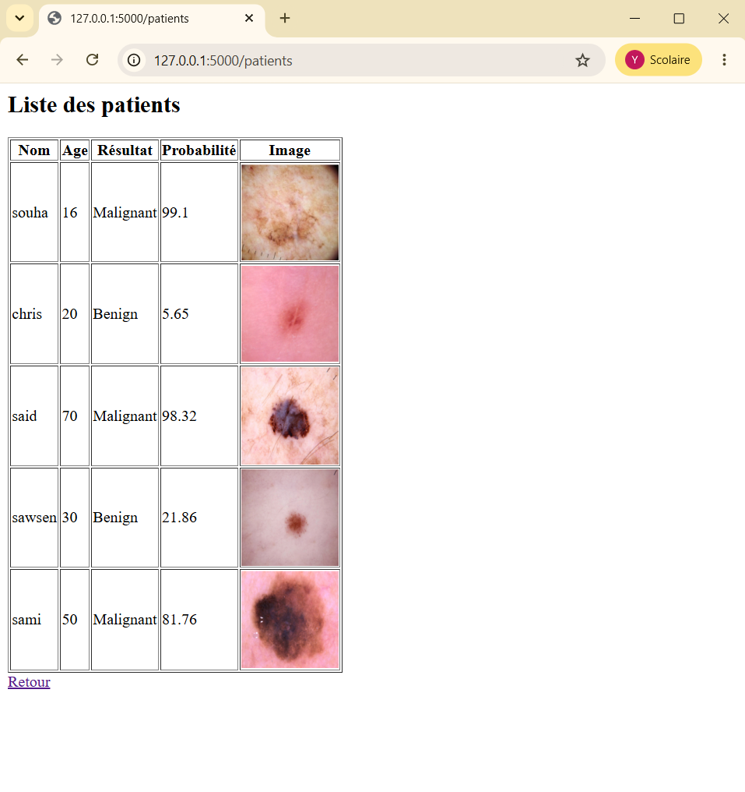

# 🩺 SKIN_CANCER_APP

Application Web Flask de détection de cancer cutané avec VGG16 (Transfer Learning)

### Page de Connexion

### Dashboard

### Analyse d'une lésion

### Résultat

### Liste des patients

## Description
Application permettant aux professionnels de santé de :
- Se connecter via un système d'authentification
- Soumettre l'image d'une lésion cutanée
- Obtenir une prédiction (Bénin ou Malin)
- Consulter l'historique des diagnostics

## Technologies utilisées
- Python / Flask
- TensorFlow / Keras / VGG16
- MySQL
- Bootstrap 5
- HTML / CSS

## Prérequis
- Python 3.x
- XAMPP (MySQL)
- Bibliothèques : Flask, TensorFlow, numpy, mysql-connector-python

## Installation
1. Cloner le repository
2. Installer les dépendances : `pip install flask tensorflow mysql-connector-python numpy`
3. Lancer XAMPP et démarrer MySQL
4. Créer la base de données `skin_cancer_db`
5. Lancer l'application : `python app.py`

## Comment lancer le projet
1. Installer les dépendances :
`pip install flask tensorflow mysql-connector-python numpy`
2. Lancer XAMPP et démarrer MySQL
3. Créer la base de données `skin_cancer_db`
4. Lancer : `python app.py`
5. Ouvrir `http://127.0.0.1:5000`

## Identifiants
- Username : `admin`
- Password : `1234`

## Auteur
yasmine ben yedder - 1TA1 - ENSTAB 2025/2026
